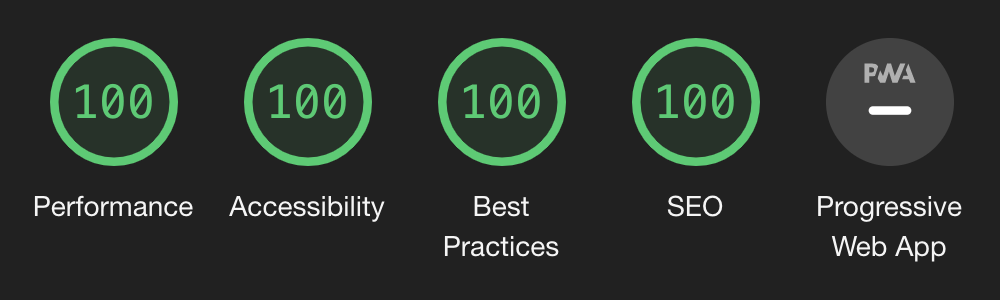

# [sreetamdas.com](https://sreetamdas.com)

Thanks for checking out my personal website and blog! Here's the source code for it :)

## Tech stack

- [React](https://reactjs.org) + [Next.js](https://nextjs.org)
- [TypeScript](https://www.typescriptlang.org)
- [styled-components](https://styled-components.com)
- [mdx](https://mdxjs.com)
- [Plausible](https://plausible.io)
- [React Icons](https://react-icons.github.io/react-icons)
- [Framer Motion](https://www.framer.com/motion)

## Overview

For a while, I had trouble following up on my side-projects so I rebuilt my website: I could now play around with pretty much everything.

The website is pretty minimal, and should hopefully provide a seamless experience. If you notice anything that you'd like to improve, feel free to [create an issue](https://github.com/sreetamdas/sreetamdas.com/issues/new) and/or send a pull request!

### The mini-game

If you don't know what I am referring to, that's great! You haven't discovered the mini-game yet. If you'd like to check it out, please open up the browser console on [sreetamdas.com](https://sreetamdas.com). 😉

You can check out some more details below ⬇️

---

<details>
	<summary><strong>❗❗ HERE BE SPOILERS ❗❗</strong></summary>

Well, the cat's out of the bag: there's a mini-game on <a href="https://sreetamdas.com">sreetamdas.com</a>! If you're forking this repository for yourself, be aware that you will be forking that as well. 😅 It isn't a "module" as such that you can just remove from the website — though the game lies in the <code>/foobar</code> subdirectory.

Pretty much wherever the mini-game is present in the repo, it's placed under a <code>foobar</code> subfolder (eg. in <code>components</code>) so you'll know when you're about to come across mini-game related code. 😄

</details>

---

## Development

```sh
$ git clone https://github.com/sreetamdas/sreetamdas.com.git
$ cd sreetamdas.com
$ npm i
$ npm run dev
```

### Newsletter

I also run a _very awesome_ newsletter! It's got curated links keeping up with the JavaScript, React and webdev world.
And mechanical keyboards! Check it out at [sreetamdas.com/newsletter](https://sreetamdas.com/newsletter) :)

You can also [view previous issues](https://buttondown.email/sreetamdas/archive),
and [subscribe via RSS](https://buttondown.email/sreetamdas/rss)!

### Lighthouse scores



<p align="center">
	perfect lighthouse scores!
</p>

## License

Licensed under the [MIT License](LICENSE.md). Feel free to use in your own projects, with attribution please. A star on the repository would be super cool too! 😄
